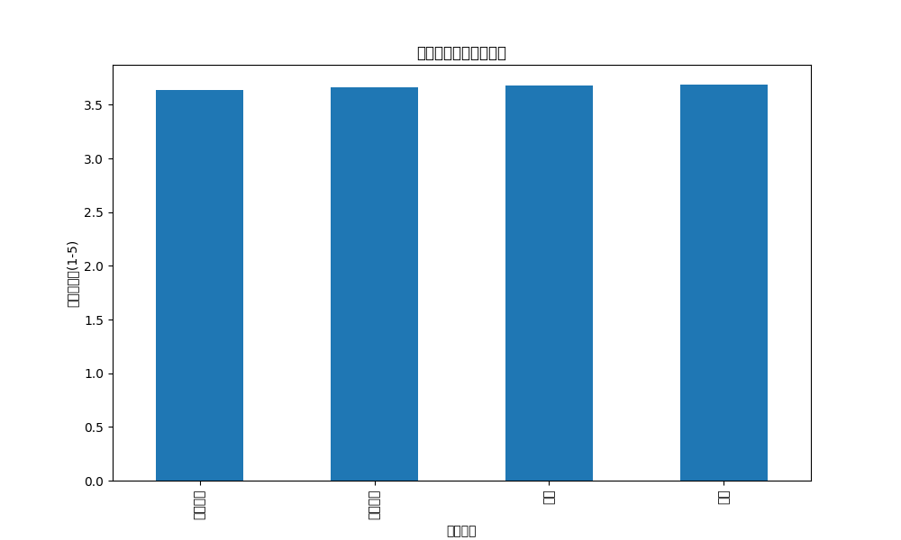
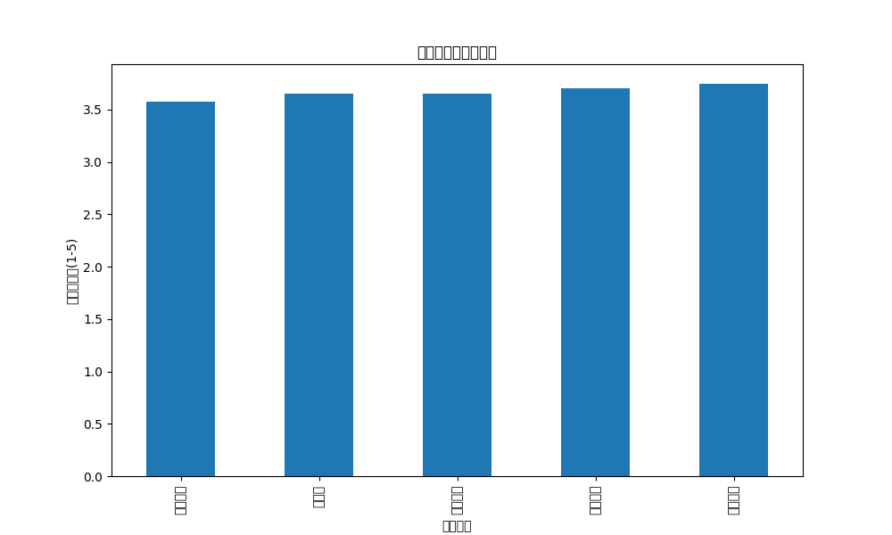
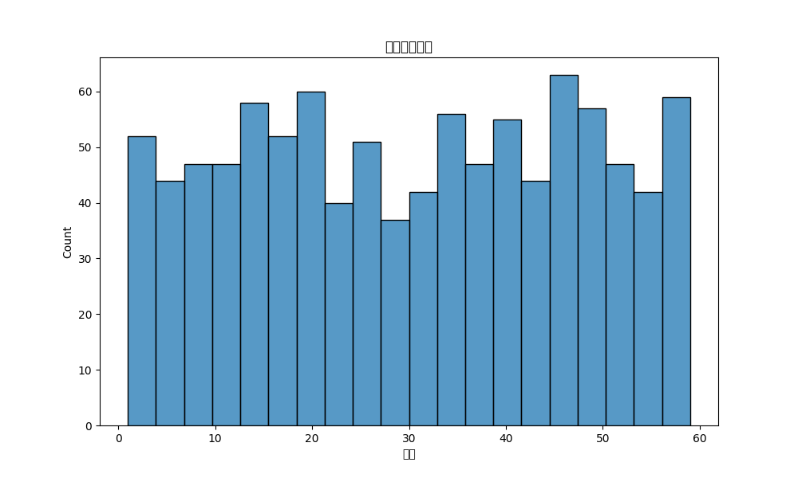
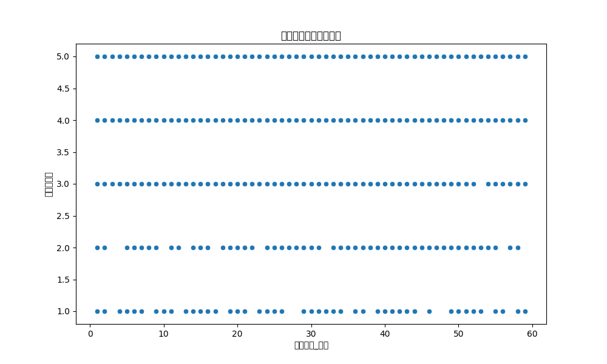

# 客户服务质量分析报告

生成时间: 2025-07-12 13:27:52

## 1. 基本概况
- 总服务案例数: 1000
- 问题解决率: 89.5%
- 平均满意度评分: 3.7/5
- 平均解决时长: 30.3分钟

## 2. 服务渠道分析
### 各渠道使用分布
| 服务渠道   |   proportion |
|:-----------|-------------:|
| 在线聊天   |        0.266 |
| 电话       |        0.265 |
| 社交媒体   |        0.241 |
| 邮件       |        0.228 |

### 各渠道满意度对比
| 服务渠道   |   满意度评分 |
|:-----------|-------------:|
| 社交媒体   |      3.63485 |
| 在线聊天   |      3.66165 |
| 电话       |      3.68302 |
| 邮件       |      3.6886  |

## 3. 问题类型分析
### 各类问题分布
| 问题类型   |   proportion |
|:-----------|-------------:|
| 订单问题   |        0.208 |
| 产品咨询   |        0.203 |
| 投诉建议   |        0.198 |
| 技术支持   |        0.197 |
| 退换货     |        0.194 |

### 各类问题满意度对比
| 问题类型   |   满意度评分 |
|:-----------|-------------:|
| 技术支持   |      3.57868 |
| 退换货     |      3.64948 |
| 投诉建议   |      3.65152 |
| 产品咨询   |      3.70443 |
| 订单问题   |      3.74519 |

## 4. 解决时长分析
- 解决时长与满意度相关性: 0.02

## 5. 优化建议
1. **渠道优化**: 满意度较低的渠道需要改进服务质量或流程
2. **问题类型聚焦**: 对高频低满意度问题类型优先优化
3. **效率提升**: 缩短解决时长，特别是对满意度影响大的问题
4. **培训重点**: 针对低满意度渠道和问题类型加强客服培训
5. **流程优化**: 分析解决时长过长的案例，优化处理流程
